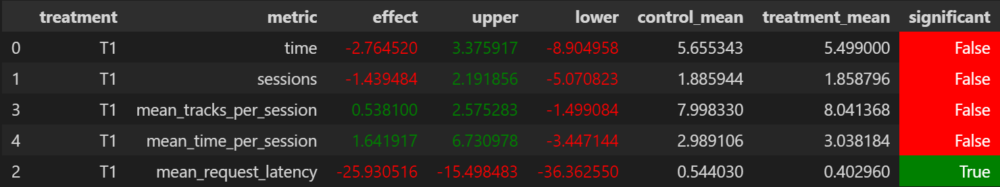

# Идея

Я решил модифицировать DSSM с семинара, улучшив его архитектуру и модифицировав обучение так, чтобы побить (или хотя бы максимально приблизиться к) StickyArtist, поскольку эта модель показалась интуитивно понятной и многообещающей.

# Детали реализации

В реализации с практики я заметил несколько минусов и мест, которые можно улучшить:

 - Отсутствие нормализации
 - Простая архитектура `dense_layer`
 - Малые размерности эмбеддингов и скрытых представлений
 - Очень маленький `weight_decay` у оптимизатора `Adam`
 - Некорректно выставленные пороги ранней остановки и уменьшения `LearningRate`

По итогу я модифицировал архитектуру следующим образом:
 - Применил `LayerNorm` в `ItemNet` и `UserNet` к итоговым эмбеддингам
 - Вместо одного полносвязного слоя сделал два полносвязных слоя (с функцией активации между ними), уменьшающих размерность в два раза по середине (по аналогии с bottleneck block в ResNet)
 - Увеличил размерности:
    - скрытых представлений с 32 до 64
    - итоговых эмбеддингов с 64 до 96

Улучшил обучение:
 - Параметр `weight_decay` повысил с `1e-6` до `1e-3`
 - Сделал раннюю остановку при изменении `val_loss` меньше чем на $0.001$ от предыдущего лучшего лосса, а так же уменьшение `LearningRate` в 10 раз при изменении `val_loss` меньше чем на $0.002$ от предыдущего лучшего лосса
 - Увеличил максимальное количество эпох до 50

Общая логика работы DSSM при этом осталась точно такой же. Полученная модель имеет 4.9M параметров.

Выше была описана конфигурация, показавшая наилучшие результаты. Внизу приведены результаты A/B экспериментов с разными вариациями моделей

# Models results

| Model | Metric | Effect | Upper | Lower | Control Mean | Treatment Mean | Significant |
|:-----:|:------:|:------:|:-----:|:-----:|:------------:|:--------------:|:-----------:|
| DSSM | mean_time_per_session | -8.708096  | -5.792421  | -11.623771 | 2.990928  | 2.730475 | True |
| DSSM with normalize | mean_time_per_session | -18.327369 | -14.612681 | -22.042056 | 2.985384  | 2.438242 | True |
| DSSM with layernorm | mean_time_per_session | -4.808849 | -0.137642 | -9.480055 | 2.963605 | 2.821090 | True |
| DSSM with layernorm, 64 hidden_dim, 1e-3 weight_decay, 30 epochs, 64 embedding_dim | mean_time_per_session | -2.408919 | 2.235039 | -7.052877 | 2.972305 | 2.900705 | False |
| DSSM with layernorm, 64 hidden_dim, 1e-3 weight_decay, 50 epochs, 64 embedding_dim | mean_time_per_session | -6.059023 | -1.497829 | -10.620218 | 2.983210 | 2.802457 | True |
| DSSM with layernorm, 64 hidden_dim, 1e-3 weight_decay, 50 epochs (0.001 min_delta), 96 embedding_dim | mean_time_per_session | -2.967782 | -0.080027 | -5.855537 | 2.992792 | 2.903973 | True |
| DSSM with layernorm, 64 hidden_dim, 1e-3 weight_decay, 50 epochs (0.001 min_delta), 96 embedding_dim, better scheduler | mean_time_per_session | 0.695803 | 5.569766 | -4.178159 | 2.963749 | 2.984371 | False |
| DSSM with layernorm, 64 hidden_dim, 1e-3 weight_decay, 50 epochs (0.001 min_delta), 64 embedding_dim, better scheduler | mean_time_per_session | -1.853241 | 1.842017 | -5.548499 | 2.972851 | 2.917757 | False |
| DSSM with layernorm, 64 hidden_dim, 1e-3 weight_decay, 50 epochs (0.001 min_delta), 64 embedding_dim, better scheduler, 2-layer dense block | mean_time_per_session | 1.641917 | 6.730978 | -3.447144 | 2.989106 | 3.038184 | False |

К сожалению, у меня не вышло получить статистически значимое преимущество над StickySrtist, но мне удалось достичь его уровня, значительно улучшив исходную модель. Вероятно, если собрать побольше данных и добавить другие фичи для DSSM, превзойти его всё же получилось бы. Результаты приведены на скриншоте



Код обучения модели лежит в ноутбуке `jupyter/HW_2.ipynb`, обучение производилось на данных, выложенных в чате. Данные, по которым делались рекомендации лежат в `botify/data/recommendations_dssm_layernorm_params_arch_3.json`. Поскольку при перезапуске симулятора результаты могут получаться немного разными, данные A/B теста, использованного для финальных результатов, лежат в `dssm_layernorm_params_arch_3/` (этот путь указан в `jupyter/Week1Seminar.ipynb`, который можно запустить для повторного получения этих результатов). 

Для получения результатов A/B эксперимента с нуля с этими рекомендациями, из корня репозитория можно запустить
```cmd
cd botify/ && docker compose up -d --build --force-recreate --scale recommender=2 && sleep 20 &&  cd ../sim && python -m sim.run --episodes 2000 --config config/env.yml multi --processes 4 && cd ../script && python dataclient.py --recommender 2 log2local ../dssm_layernorm_params_arch_3
```
(перед этим стоит удалить лежащую в корне папку `dssm_layernorm_params_arch_3`)