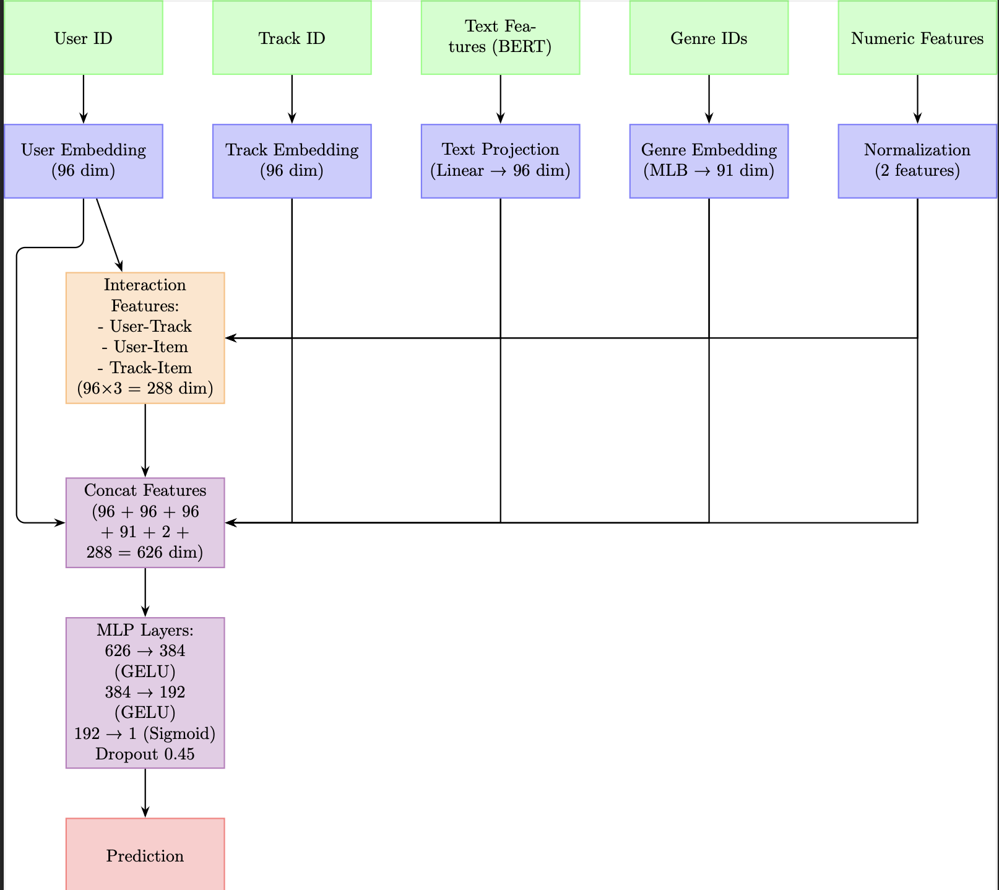

## Описание модели: MyRecommender

Нейросетевая модель `MyRecommender` предназначена для предсказания вероятности взаимодействия пользователя с музыкальным треком.

### Архитектура Модели

Модель построена следующим образом:

* **Эмбеддинги:**
    * `nn.Embedding` слои для представления пользователей (`user_embedding`) и треков (`track_embedding`).
* **Проекции признаков:**
    * Линейные слои (`nn.Linear`) для проекции текстовых эмбеддингов BERT (`text_projection_mlp`) и трансформации бинарных векторов жанров (`genre_transform_mlp`).
    * Линейные слои для проекции эмбеддингов пользователя, трека, текста и жанров в общее пространство взаимодействия (`proj_user`, `proj_track`, `proj_text_inter`, `proj_genre_inter`).
* **Взаимодействия признаков:**
    * Рассчитываются попарные взаимодействия (поэлементное умножение) между спроецированными эмбеддингами: пользователь-трек (`interaction_ut`), пользователь-текст (`interaction_ui`), трек-текст (`interaction_ti`).
    * Используется функция активации ReLU.
* **Многослойный перцептрон (MLP):**
    * Входной вектор формируется конкатенацией эмбеддингов пользователя, трека, спроецированного текстового эмбеддинга, трансформированного эмбеддинга жанров, масштабированных числовых признаков и трех векторов взаимодействий.
    * MLP состоит из нескольких скрытых слоев с нормализацией (`LayerNorm`), функцией активации GELU и Dropout.
    * Выходной слой MLP - один нейрон без функции активации (логит).

### Входные данные модели

Модель принимает следующие входные данные:

* `user_ids`: Тензор с индексами пользователей.
* `track_ids`: Тензор с индексами треков.
* `text_emb`: Тензор с текстовыми эмбеддингами треков (из BERT).
* `genre_features`: Тензор с бинарными векторами жанров треков.
* `numeric_features`: Тензор с масштабированными числовыми признаками треков.

### Выходные данные модели

Модель возвращает один логит для каждой пары (пользователь, трек), представляющий предсказанную вероятность положительного взаимодействия до применения функции сигмоиды.

### Обучение

* **Датасет (`MyDataset`):** Кастомный класс датасета, генерирующий отрицательные примеры для каждого положительного взаимодействия.
* **Функция потерь:** `nn.BCEWithLogitsLoss`.
* **Оптимизатор:** AdamW.
* **Планировщик скорости обучения:** ReduceLROnPlateau.
* **Метрика валидации:** AUC ROC.
* **Ранняя остановка:** Обучение прекращается, если метрика валидации не улучшается в течение определенного количества эпох (`PATIENCE_LIMIT`).
* **AMP:** Использование Automatic Mixed Precision (если доступно CUDA) для ускорения и уменьшения потребления памяти.

### Генерация рекомендаций

1.  Загрузка лучшей сохраненной модели.
2.  Предсказание скоров для всех треков, с которыми пользователь еще не взаимодействовал положительно.
3.  Ранжирование треков по убыванию предсказанных скоров.
4.  Сохранение Топ-100 рекомендаций для каждого пользователя в JSON файл.
5.  Сохранение обученных эмбеддингов пользователей и треков.

