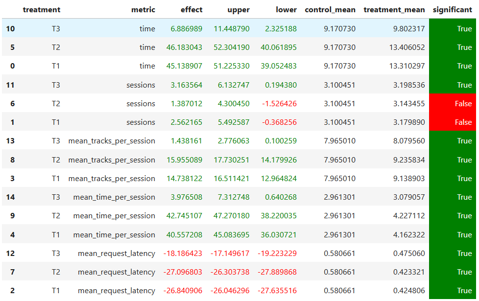

## Abstract
Обучим session-based recommendation модель [CORE](https://arxiv.org/abs/2204.11067) из библиотеки [Recbole](https://recbole.io/docs/user_guide/model/sequential/core.html) на цепочках понравившихся треков для рекомендации следующего трека. 

## Детали
Ноутбук с обучением модели лежит [тут](../HW2_train_and_rec.ipynb).

Данные для обучения собирались с помощью скрипта

```
python -m sim.run --episodes 50000 --config config/env.yml multi --processes 8
```
Собранный датасет лежит [тут](../train_data) и содержит 2923898 строк.

Прослушивания были отфильтрованы по time > 0.8, а юзеры и треки по числу интеракций >=3. Подготовленный для Recbole датасет лежит [тут](../dataset/botify_filtered) и содержит 600616 интеракций, 10000 юзеров и 36062 трека.

[Модель](../saved/CORE-Apr-11-2025_17-36-29.pth) CORE обучалась со следующей [конфигурацией](../seq_config.yaml) на протяжении 5 эпох, затем для каждого юзера были вычислены [топ-100 рекомендаций](../botify/data/recommendations_core.json).

Также были созданы модификации рекоммендера:
* [MyOwnIndexed](../botify/botify/recommenders/MyOwnIndexed.py) - рекомендует треки в отсортированном порядке, а не случайном;
* [MyOwnCoolerIndexed](../botify/botify/recommenders/MyOwnCoolerIndexed.py) - то же самое + если у трека время прослушивания < 0.1 и он во второй половине списка (индекс > 50), то начинает рекомендовать сначала.

## A\B эксперимент



* T1: CORE + MyOwnIndexed
* T2: CORE + MyOwnCoolerIndexed
* T3: CORE + Indexed
* C: StickyArtist
  
Как видно из результатов A\B-теста, модель CORE бьёт StickyArtist по всем метрикам, при этом модификации рекоммендера Indexed лидируют с ощутимым отрывом и показывают примерно одинаковый результат.
 

## Инструкция по запуску

##### Запуск сервиса


```
cd botify
docker-compose up -d --build --force-recreate --scale recommender=2
```

##### Создание окружения
```
cd ../sim
conda create -n recsys-2025 python==3.9
conda activate recsys-2025
pip install -r requirements.txt
```

##### Запуск симулятора
```
python -m sim.run --episodes 30000 --config config/env.yml single --recommender remote --seed 1488
```

##### Сохранение данных
```
cd ../script
python dataclient.py --recommender 2 log2local ~/Desktop/data
```

##### Запуск ноутбука
[Тык.](../AB_test.ipynb)

## Обучение

Для обучения модели установите необходимые пакеты
```
conda install cuda==12.8.1 pytorch==2.5.1 yaml
pip install recbole==1.2.1 ray==2.3.0
```
и запустите [ноутбук](../HW2_train_and_rec.ipynb).