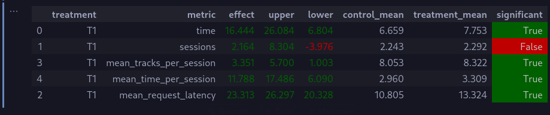

# Д/З 2 от Петрухина Ивана Алексеевича

## Отчет

### Abstract
Song2vec - использование word2vec, использовав в качестве слов идентификаторы песен. Затем, этот рекоммендер можно дообучить на своих же результатах.

### Детали
- Обучение и дообучение в [train_rec.ipynb](/train/train_rec.ipynb)
- Применение в [recommenders/lfm.py](/botify/botify/recommenders/lfm.py)

Для начального обучения используются те данные, что указаны в условии Д/З, с около 1М строк. До этого я пытался генерировать сам, но слишком поздно осознал, что мой рекоммендер учится лишь на результатах StickyArtist. Но эти данные, как оказалось, неплохо подошли.

### Результаты A/B эксперимента

Результаты с дотренировкой (`Week1Seminar.ipynb` в коммите `979430`)

Результаты с тренировкой с нуля (актуальная версия `Week1Seminar.ipynb`, я запустил все сначала чтобы убедиться в работоспособности)

## Инструкция

> Все команды для удобства выполняются из корня репозитория

1. Запустить сервер

`(cd botify; docker compose up -d --build --force-recreate --scale recommender=10)`

2. Провести симуляцию

`(cd sim; python -m sim.run --episodes 500 --config config/env.yml multi --processes 10)`

3. Скачать логи

`(cd script; rm -rf ../rec_sys_data; python dataclient.py --recommender 10 log2local ../rec_sys_data)`

4. Провести анализ

Открыть [Week1Seminar.ipynb](/jupyter/Week1Seminar.ipynb) и запустить все ячейки