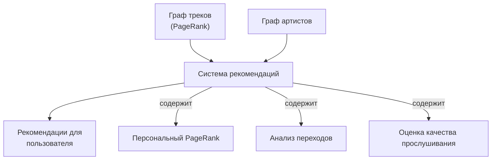

# Домашнее задание 2 отчет

## Abstract
В этой домашке я улучшал рекомендации сервиса botify (относительно 
рекомендатора StickyArtist - который рекомендует треки того же 
арстиста). Основная идея была в том, чтобы строить взвешенный направленный граф переходов между треками и между артистами (на основе истории прослушиваний). Я запускал симуляцию сервиса рекомендаций и полноценный 
A/B тест, где мой кастомный recommender был тритментом, а 
StickyArtst -- контролем. Я пытался (и добился) статистически 
значимо улучшить метрику mean_session_time по сравнению с 
рекомендером StickyArtist.

## Детали реализации

Мой рекомендер основан на следующих ключевых идеях:

1. **Графы переходов**: Два взвешенных направленных графа — между треками и между артистами. Вес ребер отражает частоту и качество переходов пользователей от одного трека/артиста к другому.

2. **Персонализация**: Система накапливает историю предпочтений для каждого пользователя, учитывая длительность прослушивания и качество взаимодействия.

3. **Алгоритм ранжирования**: Комбинация PageRank, анализа истории прослушиваний и оценки качества взаимодействия с треком по формуле:
   ```python
   combined_weight = (0.3 * transition_weight + 0.3 * page_rank + 0.4 * avg_listen_time)
   ```

Архитектура рекомендера представлена на следующей диаграмме:



## Результаты A/B эксперимента

A/B тест показал статистически значимое улучшение ключевых метрик при использовании графового рекомендера:


Главным показателем эффективности является метрика mean_time_per_session, которая демонстрирует статистически значимое увеличение продолжительности сессий пользователей.


## Инструкция по запуску

Запустить

```
make
```

в корне.

Это должно

1. создать virtualenv
2. установить в него все зависимости
3. запустить докер компоуз - и поднять инстансы рекоммендеров, redis, nginx
4. после успешного запуска - запустить симуляцию для A/B тестирования
5. после этого сохранить данные по результатам симуляции в директорию data4exp

Затем можно воспользоваться  [ноутбуком](./AnalyzeResults.ipynb) чтобы проверить, как поменялись метрики


