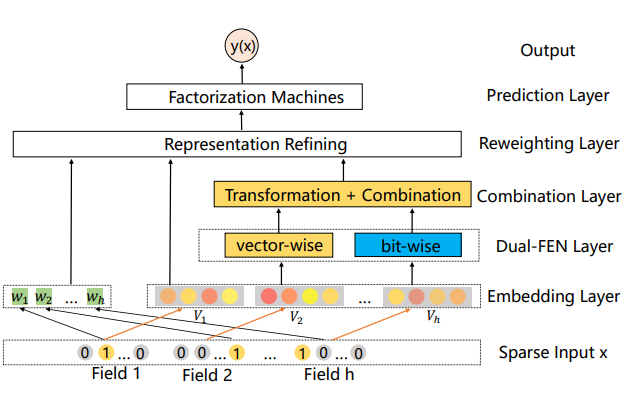
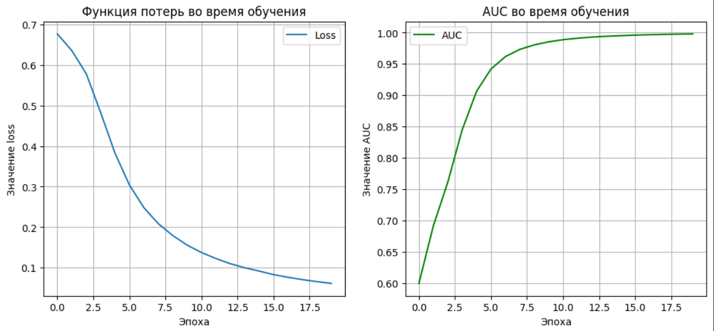
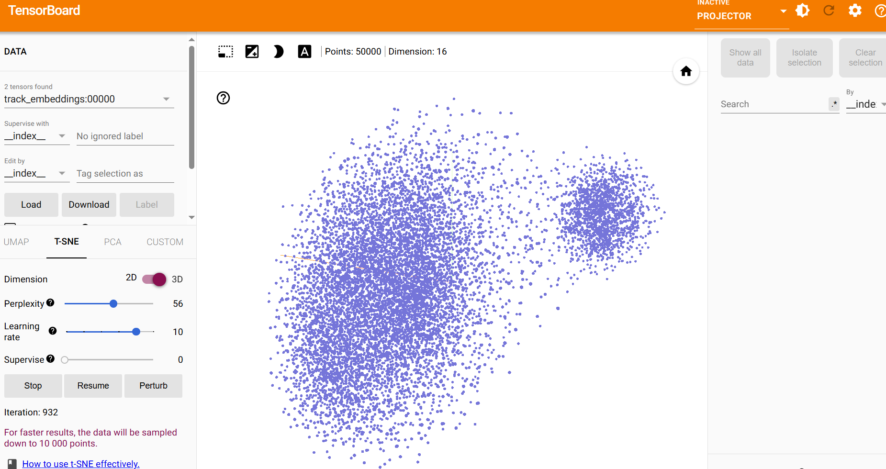
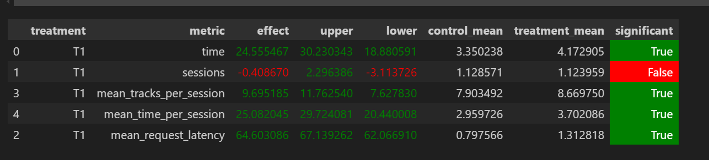

### Основное

Для обучения взял модель [DIFM](https://www.ijcai.org/Proceedings/2020/0434.pdf), которая реализована в библиотеки [DeepCTR-Torch](https://github.com/shenweichen/DeepCTR-Torch?tab=readme-ov-file)

Модель имеет следующие особенности:
- Bit-wise: Использует DNN для учёта влияния отдельных элементов эмбеддингов
- Vector-wise: Применяет Multi-Head Self-Attention для анализа взаимодействий между признаками
- Объединяет FM (Factorization Machines), Residual Networks, Self-Attention и DNN в единую модель

### Описание работы нового [реккомендера](https://github.com/EgorGod21/recsys-course-spring-2025/blob/master/botify/botify/recommenders/my_indexed.py)

- Для каждого пользователя сохраняется до 10 последних прослушанных треков, чтобы избегать повторов в рекомендациях.
- Основой служит список рекомендованных треков
- Если предыдущего трека не было — отдается первый трек из рекомендованного списка DIFM.
- Если пользователь рано переключил трек (прослушал менее 70% времени), рекомендуется случайный трек из понравившихся пользователю (из истории его любимых треков)
- В остальных случаях — один из рекомендованных DIFM, который не был недавно прослушан.
- Если подходящего трека не нашлось — вызывается запасной рекоммендер fallback (в данном случае random).

### Обучение

- Ноутбук с обучением ([ссылка](https://github.com/EgorGod21/recsys-course-spring-2025/blob/master/hw/DIFM.ipynb))
- Данные ([ссылка](https://drive.google.com/file/d/1Dou2rD9L2C68ijoP7oY5iTdcLH1sV0A0/view))
- Новый рекоммендер ([ссылка](https://github.com/EgorGod21/recsys-course-spring-2025/blob/master/botify/botify/recommenders/my_indexed.py))

После завершения обучения модели были получены эмбеддинги для пользователей и треков, на основе которых сформированы персонализированные рекомендации. Для каждого пользователя был подобран список из 50 треков, максимально соответствующих его музыкальным предпочтениям.

Лосс и AUC после обучения представлены ниже

В качестве негативных примеров были выбраны не случайные треки, а треки которые пользователь не стал слушать
После One hot кодирования информации о треков, был применен метод PCA для снижения размерности эмбеддингов

В результате эффект составил +24.56 % по сравнению со Sticky Artist

