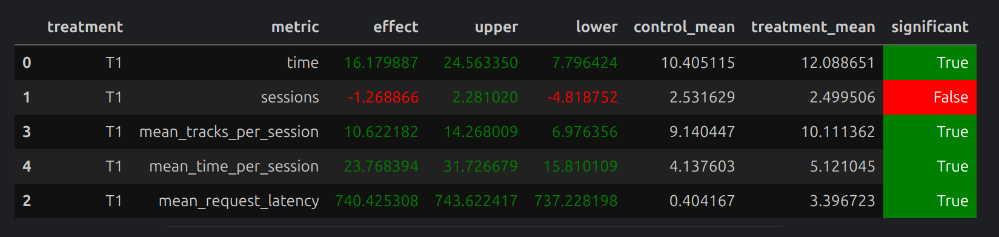

# Memory‑Hybrid DSSM Recommender

## Abstract

Я объединил **упорядоченный DSSM‑ранк** с минимальной «памятью» о показанных треках в Redis и добавил *skip / like*‑зависимые ветвления.
В итоге получился алгоритм, который держит персональный оффсет в DSSM‑списке, избегает повторов, ограничивает артиста ≤ 2 раз за сессию и мгновенно реагирует на поведение пользователя, сохраняя при этом O(1) latency.

## Алгоритм

```
ε‑TopPop (p = 0.02) ─┬─► track
                     │
DSSM[offset]─────────┘   (если допустим)
│  skip (<0.3) ─► Contextual Top‑3 (берём 1‑й) → track
│  like (≥0.8) ─► StickyArtist (random)         → track
│
├─ Diverse list (1‑й подходящий) → track
├─ User‑Based CF (1‑й подходящий) → track
└─ Indexed(DSSM) fallback (шаг вперёд + проверки) → track
```

### Ключевые эвристики

| блок                     | зачем                            | детали                                                              |
| ------------------------ | -------------------------------- | ------------------------------------------------------------------- |
| **DSSM offset**          | используем порядок релевантности | `off:dssm:{u}` хранится 24 ч; сбрасывается **только** на skip < 0.3 |
| **Artist‑limit = 2**     | боремся с монотонностью          | счётчик `mem:artists:{u}` (TTL 3 ч)                                 |
| **No duplicates**        | штраф симулятора → 0             | `mem:tracks:{u}` — SET выдач                                        |
| **Skip‑aware ветвление** | быстро меняем контекст           | sticky Artist после лайка, Contextual после скипа                   |
| **ε‑exploration**        | свежий контент новым юзерам      | Top‑100 из `TopPop`                                                 |
| **Batch Redis**          | latency ↓                        | pipeline для 2 GET + 4 ваших write                                  |

## Результаты (10 000 эпизодов)



## Запуск

```bash
# 1. сервис Botify cd botify
docker compose up -d --build --force-recreate --scale recommender=2

# 2. симулятор cd sim
python -m sim.run --episodes 10000 \
       --config config/env.yml multi --processes 16

# 3. cd script
python dataclient.py --recommender 2 log2local ../sim_data
```


