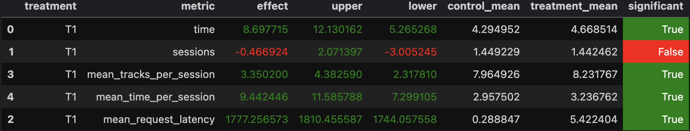

# Отчёт по выполению HW2 ВК "Рекоммендательные системы" 

1. **Идея нового алгоритма рекоммендации**  
   - Если пользователь достаточно долго слушал трек, то предложим трек того же исполнителя.  
   - Если пользователь скипнул трек, пробуем другого исполнителя.
   - Если не нашлось и по личным предпочтениям, выдаем рандомный.  
   - Не позволяем повториться прослушенным трекам, сохраняя историю.

2. **Изменения**  
   - Реализован класс `MyRecommender`.  
   - Новая колонка в `experiment.py`.
   - Рассматриваем только новую колонку со своим рекоммендером в `server.py`
   - Сравниваем со sticky artist

3. **Анализ**  
   - Подняли докер в `botify`.  
   - Сгенерили данные в `sim`.
   - Собрали данные в файлы в `script`.
   - Получили таблицу в `jupyter`

4. **Инструкции по запуску**
   - В папке `botify`:
    ```
    docker-compose up -d --build --force-recreate --scale recommender=2
    ```
   - Запуск симуляций В папке `sim`:
    ```
    python -m sim.run --episodes 10000 --config config/env.yml multi --processes 8
    ```
   - Удаляем папку `data`
   - Скачивание данных В папке `script`:
    ```
    python dataclient.py --recommender 2 log2local ../data/hw2/
    ```
   - AB тест [Jupyter](./jupyter/Week1Seminar.ipynb)
5. **Результат**



# Назаров Рустам 