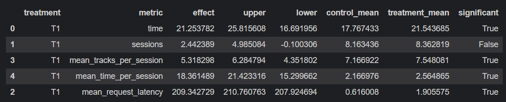

# Ссылка на репозиторий

[Репозиторий проекта](https://github.com/Dpbt/recsys-course-spring-2025)

# Abstract

В своей модели за основу я взял DSSM. Так как в списке DSSM треки отсортированы по убыванию релевантности для
пользователя,
то они выдаются по порядку. В зависимости от индекса последнего прослушанного трека и времени прослушивания я или
возвращаюсь
к началу списка, или добавляю небольшой случайный сдвиг вперед по списку DSSM. Также я добавил память о треках и
артистах,
которых пользователь уже слушал за сессию, чтобы не рекомендовать их повторно больше чем фиксированное число раз.
В случае если с помощью DSSM не удается найти подходящий трек, используются сразу несколько fallback-рекомендеров.

# Детали

Логика работы модели следующая:

1. Сначала модель пытается выбрать треки из DSSM-рекомендаций по следующей логике:
    1. Если предыдущего трека нет в списке DSSM, то берем первый трек из списка.
    2. Если предыдущий трек есть в списке DSSM, то находим его индекс $i$:
        1. Если $i \geq 15$ и время прослушивания $t < 0.05$, то начинаем сначала и выдаем первый трек из списка DSSM.
           (прошлый трек не понравился)
        2. Иначе если $i \geq 15$ и время прослушивания $t < 0.5$, то выдаем трек с индексом
           $i + 1 + randint(1, 5)$ из списка DSSM. (прошлый трек ограниченно понравился)
        3. Иначе просто выдаем трек с индексом $i + 1$ из списка DSSM. (прошлый трек понравился)
    3. Для выбранного трека из списка DSSM проверяем, что пользователь послушал его ранее не более 1 раза и слушал
       исполнителя этого трека не более 4 раз. Если это не так, то переходим к следующему треку из списка DSSM.
2. Если после прошлого шага с DSSM не удалось найти подходящий трек, то пробуем по очереди использовать переданные
   списком fallback-рекомендеры. Среди них Sticky Artist, обычный DSSM и TOP POP. Выдаваемые ими треки также проверяются
   на то, что пользователь не слушал их ранее более 1 раза и исполнителя не более 4 раз.
3. Если после прошлого шага снова не удалось найти подходящий трек, то пробуем Random-рекомендер. Пробуем получить от
   него трек, удовлетворяющий условиям по новизне и артисту. Если через 20 итераций Random вдруг все равно не выдал
   подходящий трек, то просто берем первый трек, выдаваемый Random-рекомендером.

То есть мы пытаемся с некоторой логикой блуждать по списку DSSM-рекомендаций, а если не получается, то пробуем серию
fallback-рекомендеров.

Стоит отметить, что модель примерно с такой же логикой, но без памяти о том, что уже слушал пользователь, работала не
хуже,
но раз уж я это реализовал, то решил оставить.

Все конкретные численные константы из логики модели были выбраны экспериментальным путем (кучей AB тестов).

Модель реализована в [файле](../../botify/botify/recommenders/my_best_recommender.py) (
`botify/botify/recommenders/my_best_recommender.py`).

# Результаты AB теста



Как можно видеть из результатов AB теста, моя модель обгоняет DSSM по всем представленным метрикам,
в том числе значимо по mean_time_per_session, что и требовалось.

В тесте Control - Indexed(DSSM), Treatment 1 - MyBestRecommender. Симуляции были запущены на 10000 сессий.

# Инструкция по запуску

### Запуск сервиса

В папке `botify`:

```shell
docker-compose up -d --build --force-recreate --scale recommender=2
```

### Запуск симуляций

В папке `sim`:

#### Создаем окружение

```shell
conda create -n recsys-2025 python==3.9
```

#### Активация окружения

```shell
conda activate recsys-2025
```

#### Установка зависимостей

```shell
pip install -r requirements.txt
```

#### Запуск симуляций

```shell
python -m sim.run --episodes 10000 --config config/env.yml multi --processes 8
```

### Скачивание данных

В папке `script`:

#### Скачиваем данные эксперимента

```shell
python dataclient.py --recommender 2 log2local ../rec_sys_data/hw_2/my_best_recommender_data/
```

(на данный момент папка `my_best_recommender_data` не пуста!)

### AB тест

[Ноутбук с AB тестом по полученным данным](./AB_test_my_best_recommender.ipynb)

# Дополнительно к инструкции

1. У меня проект в Windows, а окружение проекта стояло в WSL, поэтому во всех файлах мои пути для WSL закомментированы и
   подставлены
   предполагаемые пути для вас. Надеюсь, это работает.
2. В целях улучшения курса: при выполнении этого задания мне очень надоел стандартный процесс запуска системы,
   симуляций и т.д. приведенный выше.
   Поэтому я решил автоматизировать этот процесс, насколько это возможно. В данном репозитории лежит
   [файл](../../botify/botify/botify_auto.py) (`botify/botify/botify_auto.py`),
   который создает новую директорию для данных, запускает сервис, симуляции и выгружает данные.
   На данный момент он опять же настроен под WSL над Windows, но мысль в том, чтоб сделать что-то подобное универсально 
   и использовать на курсе в следующие годы, это сильно ускоряет процесс.
