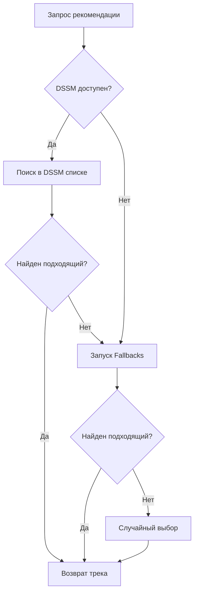

# отчёт по HW2

## Обзор
Рекомендательная система комбинирует несколько стратегий для подбора треков:
1. Первичные рекомендации от DSSM-модели
2. Резервные рекомендатели (fallbacks)
3. Случайные рекомендации

Система учитывает историю прослушиваний пользователя и предотвращает повторные рекомендации 
одних и тех же треков/артистов в рамках установленных лимитов.

## Ключевые параметры инициализации
| Параметр | Описание |
|----------|----------|
| `max_artist_num` | Макс. разрешенных рекомендаций одного артиста |
| `max_track_num` | Макс. разрешенных рекомендаций одного трека |
| `time_threshold_*` | Пороги времени для сброса рекомендаций |
| `dssm_reset_index` | Индекс для сброса DSSM-рекомендаций |
| `max_memory_entries` | Макс. хранимых записей истории пользователя |

## Основные методы

### `recommend_next()`
Главный метод для получения следующей рекомендации. Логика выбора:
1. **DSSM рекомендации**
   - Поиск в списке DSSM с циклическим индексом
   - Динамический сброс индекса при коротких прослушиваниях
   - Проверка ограничений через флаги

2. **Fallback стратегии**
   - Последовательный опрос резервных рекомендателей
   - Проверка на соответствие правилам

3. **Случайный выбор**
   - Гарантированный возврат трека после 50 попыток

### Вспомогательные методы
- `__get_next_idx_dssm()` - Инкремент/сброс индекса DSSM
- `__get_flags()` - Проверка ограничений по истории
- `_update_user_memory()` - Обновление истории с ограничением размера
- `__add_track_and_artist()` - Фиксация выбранного трека в истории

## Механизмы ограничений
1. **Треки**:
   - Не повторять трек, если он уже рекомендовался `max_track_num` раз
   - Исключение предыдущего прослушанного трека

2. **Артисты**:
   - Ограничение рекомендаций одного артиста до `max_artist_num` раз

## Особенности реализации
- **Кеширование данных**: Использование Redis для хранения:
  - DSSM рекомендаций
  - Истории пользовательских взаимодействий
  - Метаданных треков и артистов

- **Адаптивная логика**:
  - Динамический сброс DSSM-индекса при коротких прослушиваниях
  - Случайный сдвиг индекса при среднем времени прослушивания

- **Отказоустойчивость**:
  - Каскадный переход между стратегиями
  - Гарантированный возврат результата через случайные рекомендации

## Пример потока данных

## A/B тест

[ноутбук](../hw_2/ab.ipynb)

* данные взяты из беседы вк курса, не выгружал их в гит, просто обучил на них модель