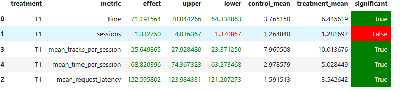

### 1. top\_shuffle

Минорный алгоритм top_shuffle работает следующим образом(был взят просто для тестирования):

1. Выбираем треки, которые пользователь прослушал с долей времени ≥ 0.9
2. Из этого множества отбираем:

   * первые 15 треков по количеству прослушиваний
   * 15 случайных треков из того же множества
3. Объединяем полученные треки и перемешиваем

---

### 2. MVP v1: По жанрам и порог прослушивания

**Подготовка данных:**
0. Сбор данных я собрал со всех семинаров + нагенерил сам получилось ~25млн.
1. Определяем топ-жанры пользователя
2. Выбираем все треки из этих жанров, которые пользователь прослушал
3. Если у пользователя оказалось < 5 жанров, с помощью KNN находим ближайшего по вкусу пользователя и расширяем список его жанрами.

**Алгоритм выдачи:**

1. Если общее время прослушивания пользователя ≥ `THRESHOLD`, выдаем трек из того же жанра.

   * Если трек мультижанровый, берем главный жанр (первый в списке).
   * Это помогает избежать повторов из редких мультижанров.
2. Если время прослушивания < `THRESHOLD`, выбираем рандомно новый жанр их предпочтений пользователя, который не является подмножеством текущего.

---

### 3. MVP v2: Доверительный интервал для порога

Чтобы более точно вычислять порог `THRESHOLD`, внедрил доверительный интервал для пользователей, прослушавших ≥ 10 треков:

---

### 4. MVP v3: Уход от рандома

1. Пробовал Multi-armed Bandits — безуспешно.
2. Пробовал NARM (онлайн-инференс, чтобы выдавал следующий трек) — тоже не дало результатов:
   * Это я связываю с тем, что модель обучалась на гладких сессиях, в то время как нужны были «скачки» в поведении (например, сессии вида 1.0 → 0.8 → 0.2 → 1.0). Как отфильтровать такие сессии я не догадался.
3. Использовал DPP (семинарская реализация + настройка гиперпараметров с помощью оптуны) — без заметного улучшения.
4. Успех принес LightFM (семинарская реализация), обученная на моих данных.

---

### Как можно улучшить? 
1. Избавиться от колхоза в users_genres_data. Для некоторых жанров собралось слишком много треков, которые пользователь попросту никогда не послушает. Да и самих жанров оказалось слишком много. Как бы это и плюс, потому что было собрано много данных и позволяет нам буквально получить вкус пользователя, но и слишком наивно, для маленьких катологов пойдет, но если айтемов больше, то уже будет плачевно.
2. Добавить какой-то бустинг или деревья, чтобы лучше искать порог.

