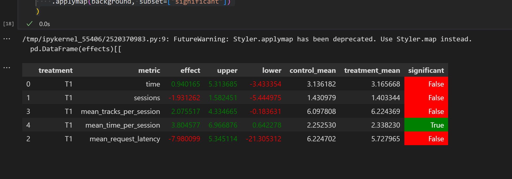

Извините, что так поздно высылаю, не хватает 6 баллов до зачета, очень хочется этого не допустить,если еще возможно. Пыталась сделать результат аб теста лучше, в итоге что-то получилось, но немного.

Логика работы:
Обработка прослушанного трека:
1)Запоминается в истории пользователя.
2)Если трек был прослушан слишком мало времени (менее порога skip_threshold), считается, что он не понравился — система рекомендует разнообразный трек.
3)Если трек был прослушан достаточно долго, система рекомендует похожий трек от того же исполнителя.
Рекомендация похожего трека:
    Выбирается случайный трек от того же исполнителя, который ранее не слушался.
Рекомендация разнообразного трека:
    Выбирается случайный трек от другого исполнителя, не присутствующий в недавней истории пользователя.

Если подходящих рекомендаций нет, используется запасной.

Плюсы:

mean_time_per_session — значительный рост, пользователи стали дольше проводить время в сессии.
mean_tracks_per_session, time — небольшой рост.

Минусы:

sessions — снижение количества сессий.
mean_request_latency — ухудшение времени отклика.

К сожалению, победить получилось не везде.


Инструкция по запуску
   ```
   conda create -n recsys-2025 python==3.9
   ``` 
   ``` 
   conda activate recsys-2025
   ``` 
   ```
   pip install -r requirements.txt

docker-compose up -d --build --force-recreate --scale recommender=2

python -m sim.run --episodes 10000 --config config/env.yml single --recommender remote --seed 31337 

в jupyter 

pip intall ipykernel, matplotlib
   
