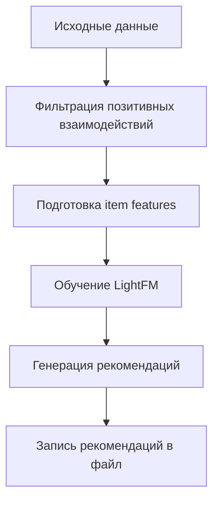
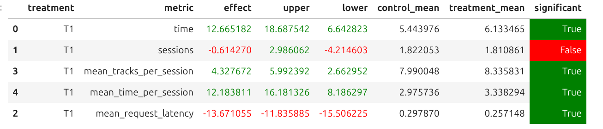

# Отчёт о домашнем задании №2

_Маркелова Светлана_

## Abstract

Я модифицировала базовую реализацию LightFM с семинара, добавив использование item features (признаков треков) при обучении модели и генерации рекомендаций.  
Я также опробовала другие модели: collaborative filtering + content-based, модифицировала DSSM с семинара, но лучше всего показала себя модель LightFM.

## Детали

Что было изменено:

1. Собраны данные (~3.3 млн прослушиваний) для обучения модели
2. Добавлены item features:
   - Жанры
   - Артисты
   - Уровни популярности
   - Длительность треков 
     Это позволило модели учитывать не только взаимодействия пользователей с треками, но и содержательные характеристики самих треков.
3. На 20 эпохах подбирались гиперпараметры для модели при trials=30 в Optuna, которые в дальнейшем были использованы при обучении модели.
4. Улучшена генерация рекомендаций: при предсказании теперь явно используются item_features.

## Результаты A/B эксперимента

Эксперимент проводился на 2000 сессий по инструкции из модуля `sim`.  
В результате были получены статистически значимые улучшения метрик mean_time_per_session, time и mean_tracks_per_session по сравнению с рекомендером StickyArtist.  
В контроле - StickyArtist, в тритменте - мой рекомендер:

## Инструкция по запуску

Запуск эксперимента осуществляется по стандартным инструкциям по работе с `botify` и `sim`.

- Полученные рекомендации находятся в `botify/data/recommendations_hw2.json`, также для них внесены соответствующие изменения в файлы `botify/config.json` (создана новая база Redis), `botify/server.py` (создан коннект к новой базе и загружены рекомендации).  
- В `botify/experiment.py` создан эксперимент `HW_2`. В `botify.server.NextTrack` используется этот эксперимент для выбора рекомендера между моим рекомендером и `StickyArtist`.
- Обучение модели находится в `hw2_done/hw2_solution.ipynb`.
- Результаты A/B эксперимента - `hw2_done/AB_test.ipynb`.
- Просимулированные данные для A/B эксперимента - `docker_logs/docker_logs/*`.